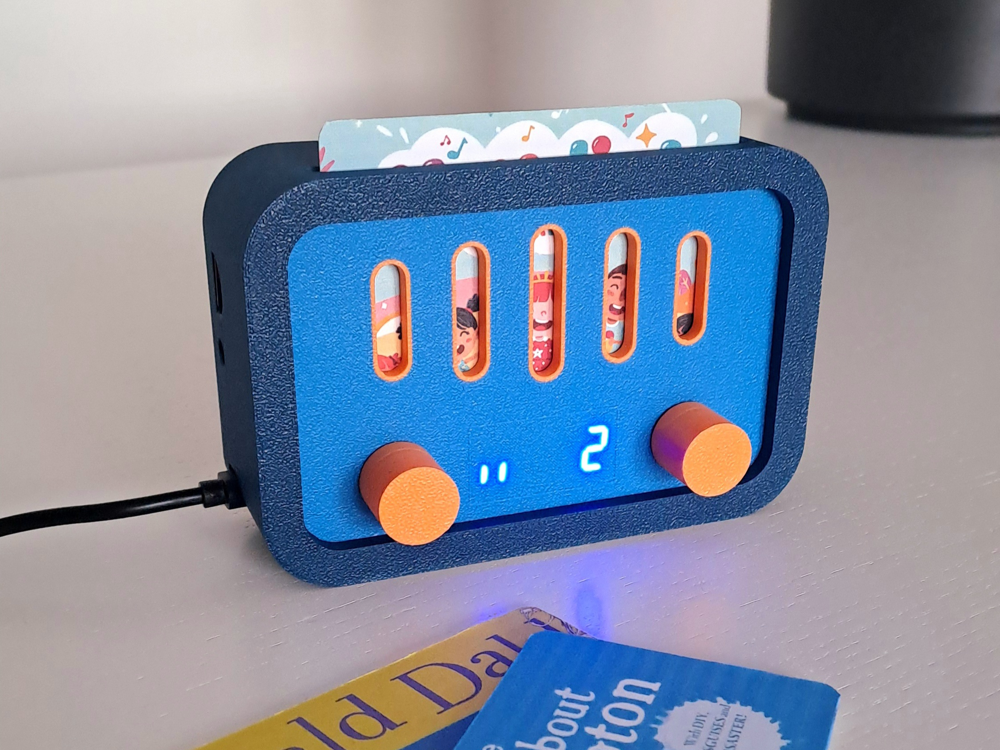
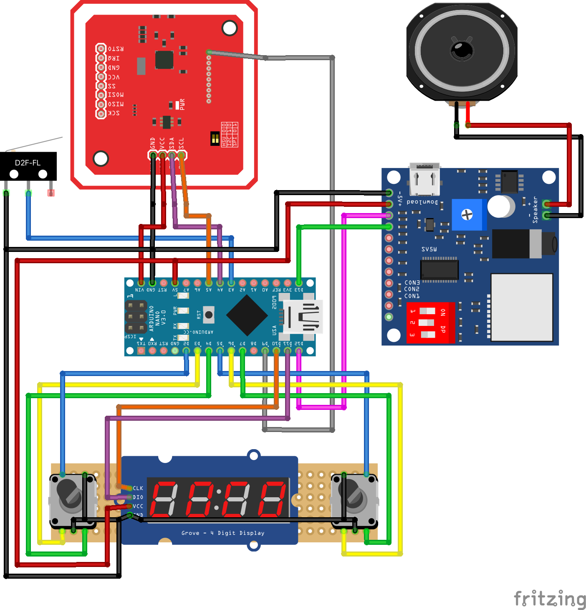
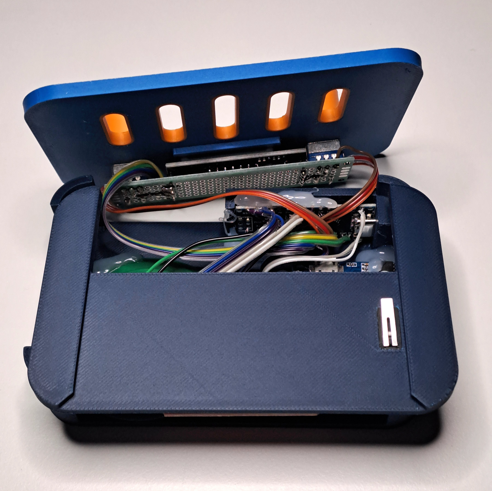
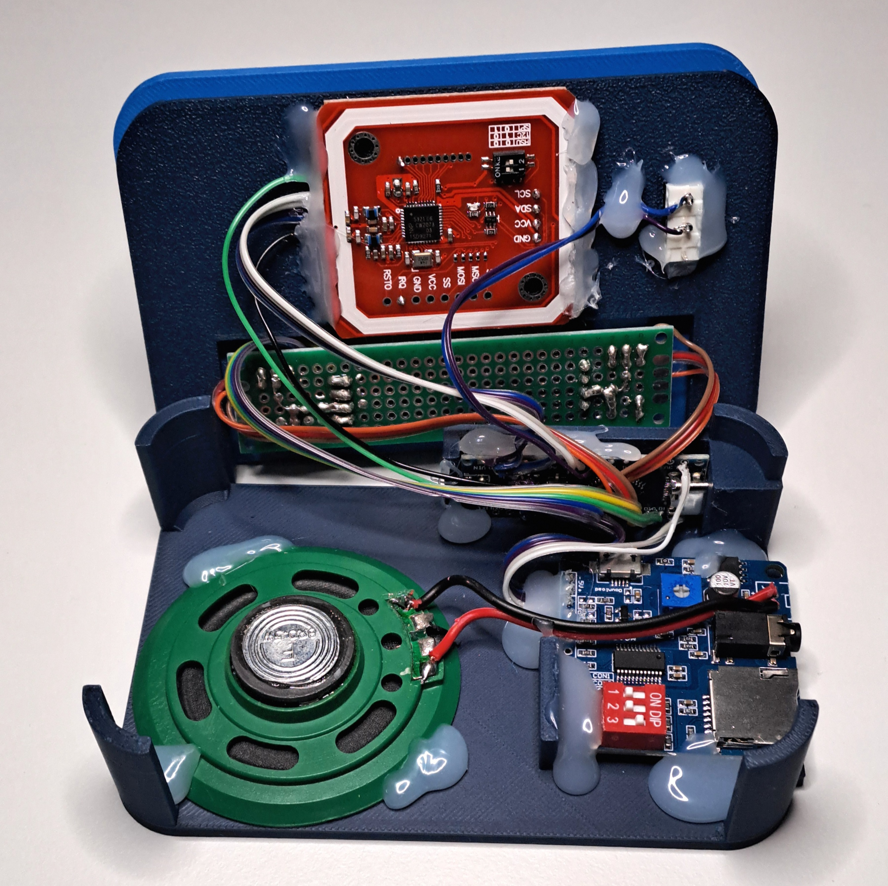

# Yaydio! 📻
**No more scratched CDs!**

**Yaydio!** is a portable music player designed for kids, ditching the hassle of CDs in favor of easy-to-use keycards.

## ✨ Features
- **Keycard playback:** Insert a keycard to instantly play an album.
- **Simple controls:** Play/pause, next/previous track, volume up/down.
- **Audio options:** Built-in speaker or connect headphones via the 3.5mm jack.
- **High capacity:**
    - Up to 999 songs per album
    - Up to 9999 albums
    - Up to 65535 songs in total
    - Supports micro SD cards up to 32GB.
- **MP3 compatibility:** Plays all your favorite MP3 files.
- **Affordable & accessible:** Works with cost-effective MF S50 RFID keycards.

## 🕹️ Usage

### Play / pause
Inserting a keycard into the **Yaydio!** will automatically start the playback.

Press either knob to pause or resume the playback.

Remove the keycard to stop the playback.

### Volume control
Turn the left knob to increase or decrease the volume.

### Next / previous track
Turn the right knob to skip to the next or previous track.

### Setup
1. Format the SD card to FAT16 or FAT32 and name it `YAYDIO`.
2. Copy the `README.txt` file onto the SD card.
3. Windows only: Download [DriveSort](https://www.anerty.net/software/file/DriveSort/?lang=en) and copy `DriveSort.exe` onto the SD card.
4. macOS only: Download [FatDriveSorter](https://fat-drive-sorter.netlify.app) and copy `FatDriveSorter.app` onto the SD card.

### Add albums to the SD card
1.  Create a new folder named `0001`, where "1" represents the next album number.
2.  Copy the album's songs into the folder you created.
3.  Rename the first song of the album to `001.mp3`.
4.  Repeat steps 1-3 for each album.
5.  Windows only: Use `DriveSort` to sort the files alphabetically in the SD card's table.
    -   Sort by `long name` and `ascending`.
    -   Remember to press the save button.
    -   You may need to sort every new folder individually and press save after each one.
6.  macOS only: Use `FatDriveSorter` to sort the files alphabetically in the SD card's table.
    -   Next to `Order:` select `Directories first`.
    -   Tick the box next to `Case-sensitive:`.

### Assign an album to a keycard

1. Insert the keycard into the **Yaydio!**.
2. Press the left and right knobs simultaneously.
3. Turn the right knob to select the album number.
4. Press the right knob to write the album number to the keycard.

## 🔨 Make your own

### 🧵 Wiring

| Left Rotary Encoder | Arduino Nano |
| ------------------- | ------------ |
| SW                  | D2           |
| SW GND              | GND          |
| DT                  | D3           |
| CLK                 | D4           |
| GND                 | GND          |

| Right Rotary Encoder | Arduino Nano |
| -------------------- | ------------ |
| SW                   | D5           |
| SW GND               | GND          |
| DT                   | D6           |
| CLK                  | D7           |
| GND                  | GND          |

| 4-Digit 7-Segment 0.36 Inch TM1637 | Arduino Nano |
| ---------------------------------- | ------------ |
| CLK                                | D10          |
| DIO                                | D11          |
| GND                                | GND          |
| 5V                                 | 5V           |

| Card Switch | Arduino Nano |
| ----------- | ------------ |
| NO          | A3           |
| COM         | GND          |

| PN532 NFC Module V3 | Arduino Nano |
| ------------------- | ------------ |
| GND                 | GND          |
| VCC                 | VIN (NOT 5V) |
| SDA                 | A4           |
| SCL                 | A5           |
| RSTPDN              | D9           |
| Switches: ON, OFF (I2C mode)       |

| DY-SV5W Voice Module  | Arduino Nano |
| --------------------- | ------------ |
| -                     | GND          |
| +                     | 5V           |
| TXD                   | D12          |
| RXD                   | D13          |
| Switches: OFF, OFF, ON (UART mode)   |

| DY-SV5W Voice Module  | Speaker      |
| --------------------- | ------------ |
| Speaker +             | +            |
| Speaker -             | -            |

### 🏗️ Assembly

[yaydio.step](yaydio.step) contains the models of the 3D-printed parts.

**Printer:** Bambu Lab A1 with AMS

**Nozzle:** 0.4mm

**Preset:** `0.20mm Standard @BBL A1` with supports enabled

**Filaments:**
- Bambu Lab PLA Matte Mandarin Orange (11300)
- Bambu Lab PLA Matte Marine Blue (11600)
- Bambu Lab PLA Matte Dark Blue (11602)

